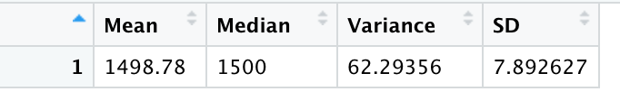
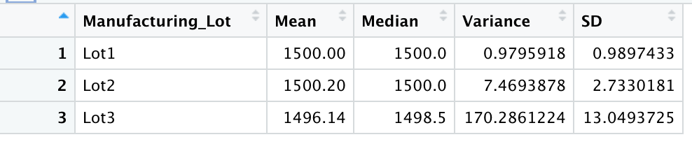
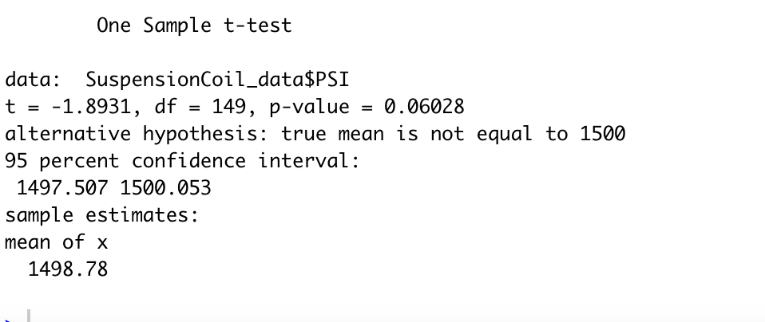
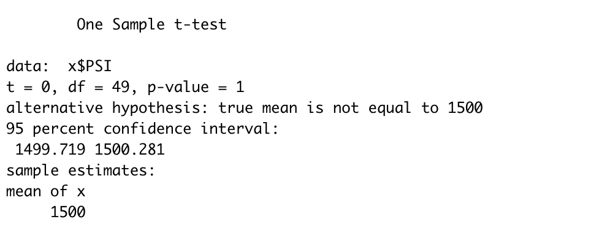
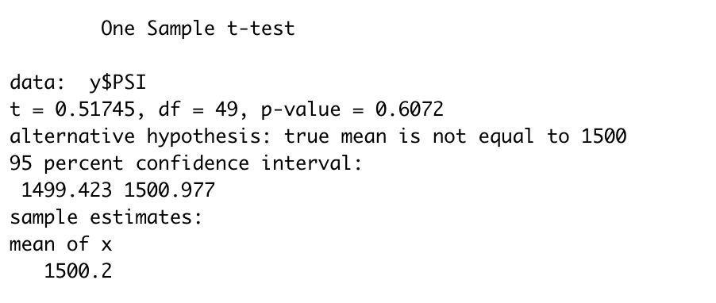
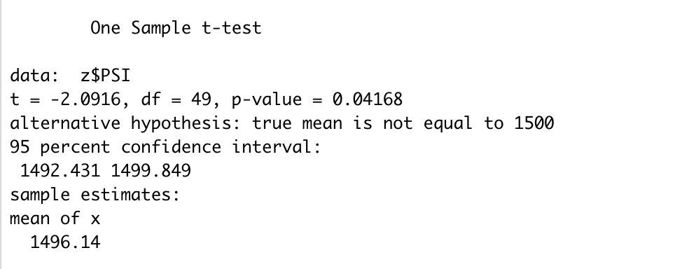

# MechaCar_Statistical_Analysis

## Linear Regression to Predict MPG

[Image 1](Deliverable_1.png) shows the formula and output for formula to predict MPB.  Looking at the formula intercept, vehicle length and ground clearance provide the non-random amount of variance to the MPG values in the dataset.  

The slope of the model is not considered to be zero as the p-value is 5.35e-11 and is a lot lower than then 0.05.  Therefore, there is significant evidence to reject the null hypothesis.  This reinstates that the slope of the line is not zero.

The Multiple R-squared values of the equation is 0.7149.  Which indicates that over 71% of the time the linear formula can be used to predict mpg of MechaCar prototype effectively. 

## Summary Statistics on Suspension Coils

 shows the total_summary and  shows the lot_summary table.  The current manufacturing data meets the design specification.  According to the data, the total mean is 1498.78 and the median is 1500 which shows that the data has a normal distribution.  Although the standard deviation is 7.89 indicating that the data is scattered over wide range.  The design specifications for the MechaCar suspension coils dictate that the variance of the suspension coils must not exceed 100 pounds per square inch and the current data shows that the variance of the current lots is 62.29 thus under the specification.  So, the current manufacturing data meets this design specification for all manufacturing lots in total.  However, according to the lot summary, the variance of Lot 3 has the highest standard deviation of 13% and the variance is 170.29.  Therefore, on its own Lot 3 would fail the specification.

## T-Tests on Suspension Coils

 shows that according to the one sample t test.   At 95% confidence interval and a p-value of 0.06028 we do not have enough evidence to reject the null hypothesis.

 shows the one sample t-test for lot1, which shows the p-value of 1 indicating that we fail to reject the null hypothesis.  Similarly, according to  for lot2, with a p-value of 0.6072.  This indicates that the  for lot 3 with a p-value of 0.04168 indicates that it is lower than 0.05 therefore, we have evidence to suggest that we can reject the null hypothesis.

## Study Design: MechaCar vs. Competition
